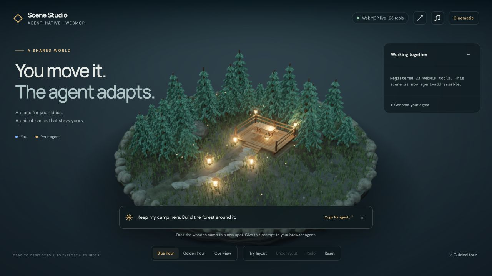

# Agent-Native 3D Scene Studio

**You move it. The agent adapts.** A shared 3D diorama where a person places a camp and a browser agent reshapes the surrounding forest, path and lanterns through WebMCP. The camp stays exactly where the person put it.

[Live studio](https://agent-native-3d-studio.netlify.app) · [30-second demo script](DEMO.md) · [Submission description](SUBMISSION.md) · [MIT license](LICENSE)



## Try the collaboration

1. Drag the wooden camp to another spot. Its blue outline and the **YOU** activity entry identify the human edit.
2. Give a connected browser agent the prompt below. It discovers the page tools, reads the actual selection and human edits, then adjusts the environment.
3. Click **Undo layout**. Only the layout's positions revert. The camp, later edits and material changes remain.

> Read the live scene, including my selection and human edits. Keep my camp exactly where I placed it. Use arrange_scene to adapt the path, trees and lanterns around it, keeping access clear. Then frame a beautiful shot.

**Try layout** calls the same handler locally, with `actor: human`. **Guided tour** is an explicitly labeled local script, with `actor: demo`. Neither button invokes an AI model. A connected agent's WebMCP calls appear as **AGENT · WEBMCP**, with the full request and result available in the activity log.

## Why WebMCP matters here

The WebGL canvas doesn't expose the scene graph through the DOM. A screenshot contains visible objects, but not their stable ids, exact positions, human-edit history or undo semantics. WebMCP lets this page publish those capabilities as discoverable, structured tools in the same live browser session. The agent can observe, act and verify while the person keeps the mouse.

A custom API or other automation integration could provide similar capabilities. The contribution here is the **standard browser-facing contract**, shared live state and reversible collaboration—not a claim that 3D automation is otherwise impossible. See the [Chrome WebMCP documentation](https://developer.chrome.com/docs/ai/webmcp).

## What is implemented

- Procedural forest diorama: branched pines, wood grain, beveled terrace furniture, glass lanterns, layered rock, instanced grass, reflection lighting, ambient occlusion and restrained bloom. No external model or texture downloads.
- `describe_scene` exposes `selected_id`, `human_edits`, scene version and layout history. `query_scene` adds pagination and real world-space bounds.
- `arrange_scene` plans around the live camp and fixed objects before changing anything. Existing human edits and untagged objects stay fixed. Blocked arrangements fail without partial placement.
- `undo_layout` and `redo_layout` use a position journal. Objects moved later or rebuilt by import/reset are skipped. Human takeover during a layout interrupts affected movement; grabbing its camp stops the arrangement.
- Real provenance: WebMCP, local buttons and the guided tour are labeled separately. The actor label identifies the invocation path; it is not authentication of a remote model.
- Human camera takeover, reduced-motion handling, optional performance mode, five lighting moods, scene share links, general building tools and chess geometry.

## Tools (23)

| Purpose | Tools |
| --- | --- |
| Discover and inspect | `help`, `describe_scene`, `query_scene` |
| Cooperate around human placement | `arrange_scene`, `undo_layout`, `redo_layout` |
| Build and edit | `add_object`, `transform_object`, `set_material`, `scatter`, `delete_objects` |
| Direct the scene | `set_lighting`, `frame_camera`, `camera_path`, `set_ui`, `set_music` |
| Save and restore | `snapshot`, `undo`, `export_scene`, `import_scene` |
| Group operations | `batch` |
| Chess geometry | `board_square`, `chess_move` |

Registration uses `document.modelContext.registerTool({ name, description, inputSchema, annotations, execute }, { signal })`. Tools return an operation envelope containing `ok`, `operation_id`, `actor`, before/after scene versions, `applied`, `duration_ms` and a result or error. Mutating tools can reject stale observations through `expected_scene_version`. Animations settle before the call reports live values, except explicit bulk `add_object{animate:false}`.

General edits use whole-scene snapshots. Cooperative arrangements have their own position journal; use **layout undo** to preserve later human work. The layout tools cannot be nested inside `batch`. A running layout rejects competing tool mutations while still allowing mouse interaction and read-only queries.

## Run and verify

```bash
npm ci
npm run dev
npm run build
npm run smoke
```

The smoke suite uses its own free preview port, exercises every listed tool and checks observable behavior: pointer placement, preserved camp coordinates, selective undo/redo, later edits, invalid calls, import validation, ordinary undo and stale versions. Results are written to `scripts/smoke-result.json`. GPU-less CI runs the same semantic suite in Performance mode through software OpenGL; the cinematic view is also checked in a hardware-accelerated browser.

Native WebMCP requires a supporting browser/client. In supported Chrome testing builds, enable `chrome://flags/#enable-webmcp-testing`; the status chip reports actual API availability. The scene and local controls also work without WebMCP. `?agent=1` exposes a clearly labeled developer harness for handler tests.

## Limits

- The editable surface is flat at y=0; the layered island is art direction, without physics or terrain simulation.
- Layout adaptation applies to the starter scene's tagged paths, grove and lanterns around a camp. It is not a general-purpose layout solver. Fixed obstacles can make a request infeasible.
- A one-second scene operation does not imply a one-second model response. Agent discovery and reasoning time depend on the client. The 30-second presentation is an edited real session.
- General snapshot undo replaces the whole scene. Only layout undo preserves unrelated later edits.
- Materials are edited per object. Share links carry scene state, not the live undo journal or accounts, and can become long.
- Chess tools provide geometry and animation, not a chess rules engine.
- Cinematic rendering costs more than performance mode; frame rate depends on hardware, viewport and scene size.

MIT licensed. Bundled DM Sans and Manrope fonts use their respective SIL Open Font Licenses in [public/fonts](public/fonts). Built with TypeScript, three.js and Vite for [The WebMCP Challenge](https://webmcp.devpost.com/).
