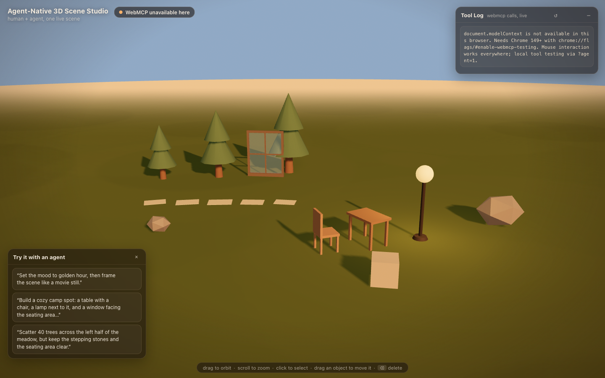

# Agent-Native 3D Scene Studio

A cozy 3D scene studio in the browser where a human and an AI agent build the **same live scene at the same time** — the agent through [WebMCP](https://developer.chrome.com/docs/ai/webmcp) tools, you through the mouse, both without ever blocking the other.



## Why this needs WebMCP (not just benefits from it)

A WebGL canvas is a single, empty element to any agent. There is no DOM to read, no button to click, no text to scrape — the entire application state (objects, transforms, materials, camera, light) lives invisibly in the scene graph. Without WebMCP this application is not merely *slow* for an agent to operate, it is **inoperable**; the best an agent can do is blindly drag pixels across a canvas. Most WebMCP demos put tools on top of a DOM the agent could always have actuated anyway — for them WebMCP is an accelerant. Here it is the *prerequisite*: seven (plus two) structured scene tools turn an inaccessible black box into a collaborative canvas, while the human keeps full mouse control at all times.

## Try it live

**URL:** <https://agent-native-3d-studio.netlify.app>

Requirements (the API is experimental, so one-time setup):

1. **Chrome 149 or newer** (stable, Beta, Dev, or Canary — check `chrome://version`).
2. Open `chrome://flags/#enable-webmcp-testing`, set **Enabled**, and relaunch.
3. Optionally install the agent simulator: the free
   [Model Context Tool Inspector](https://chromewebstore.google.com/detail/gbpdfapgefenggkahomfgkhfehlcenpd)
   extension (by the Chrome team). It lets you chat with the page's tools directly.
4. Load the studio. The status chip top-left should turn green: **“WebMCP live · 9 tools”.**

Then paste any of these into the Inspector (or any WebMCP-aware agent) and watch the scene change while your mouse stays fully functional:

| # | Prompt | What it exercises |
|---|--------|-------------------|
| 1 | “Set the mood to golden hour, then frame the scene like a movie still.” | `set_lighting` + `frame_camera` |
| 2 | “Make it night and let the lamp glow warm.” | `set_lighting` + `set_material` (emissive drives the lamp’s real light) |
| 3 | “Build a cozy camp spot: a table with a chair, a lamp next to it, and a window facing the seating area.” | multi-step `add_object` + `transform_object` |
| 4 | “Scatter 40 trees across the left half of the meadow, but keep the stepping stones and the seating area completely clear.” | `describe_scene` + `scatter` with `exclusion_zones` |
| 5 | “What’s in the scene right now? Then move the table two meters toward the window and give me a hero shot of it.” | `describe_scene` → `transform_object` → `frame_camera` |

While an agent works: **drag to orbit, click to select, drag objects to move them, ⌫/Delete to remove.** Grabbing the camera also cancels any in-flight agent camera move — the human always wins. Every tool call appears in the visible **Tool Log** (top right), each mutating tool auto-saves a restore point (↺ button or `undo` tool steps back).

No WebMCP in your browser? The scene still works with the mouse, the chip tells you exactly what's missing, and `?agent=1` exposes a local dev panel that calls the identical tool implementations — clearly labeled as a dev harness, never auto-activated.

## The tools

| Tool | Purpose | Why this shape |
|------|---------|----------------|
| `describe_scene` | Full live state: objects, transforms, colors, camera, lighting. | The eyes. Without it the agent is blind; with it, one-way commands become a dialogue (look → critique → refine). |
| `add_object` | One object: primitives + furniture presets (tree, rock, lamp, window, chair, table). | Scoped to a single, well-validated creation with enums for every type — no free-form hallucination surface. |
| `transform_object` | Move/rotate/scale one id, a name, or a batch — absolute or relative. | Batch targets + relative mode match how people actually direct edits (“move those three back a bit”). |
| `set_material` | Color, roughness, metalness, emissive, opacity. | Material personality in one call; emissive also drives the lamp’s real point light, so “make it glow” *glows*. |
| `set_lighting` | Five curated mood presets (golden_hour, night_neon, studio, overcast, moonlit) + intensity + sun azimuth. | Sky, fog, sun, ambient switch as one coherent, animated mood instead of five fiddly parameters to hallucinate. |
| `frame_camera` | Animated fly-to shot of an object or the whole scene (6 angles, distance, focal length). | Gives the agent cinematography: hero and three_quarter angles, 35mm-equivalent lens. The result reports the pose only **after** the move has settled. |
| `scatter` | Distribute up to 200 instances over an area with jitter, scale/rotation variance and **exclusion_zones**. | The 20-minutes-by-hand proof moment: “a forest, but not on the path.” |
| `snapshot` *(bonus)* | Save a named restore point. | Reversibility is a trust primitive — Chrome's own security guidance asks for it. |
| `undo` *(bonus)* | Step back to the last restore point. | Every mutating tool auto-captures one before it runs, so undo is always meaningful — including after an agent mistakes. |

## How the WebMCP integration works

Tools are registered through the WebMCP imperative API, guarded by feature detection so the page degrades gracefully in non-WebMCP browsers. This is the real registration path from [`src/webmcp.ts`](src/webmcp.ts):

```ts
export async function registerTools(ctx: ToolContext, log: ToolLogger): Promise<number> {
  const mc = document.modelContext;
  if (!mc) return 0; // status chip explains what's missing

  for (const def of TOOL_DEFS) {
    await mc.registerTool(
      {
        name: def.name,
        description: def.description,        // tells the model *when* to use the tool
        inputSchema: def.inputSchema,        // strict enums + ranges: no free-text to hallucinate
        execute: async (input) => invoke(ctx, def, input ?? {}, log),
      },
      { signal: controller.signal },         // owning the tool lifecycle
    );
  }
  return registered;
}
```

Design decisions worth calling out (all learned from live agent testing):

- **Structured, short results.** Every tool returns compact JSON (`{ok, operation_id, scene_version, …}`) within the ~1.5K output budget, so agents can verify their own work.
- **Results are only reported after the animation settles.** Tools `await` the scene transition and then report the *live rendered* values — an immediate `describe_scene` after `transform_object` matches the tool result, always.
- **Human interruption is explicit.** If the user grabs the camera or a newer command supersedes a transition, the tool says so (`applied: false` + live values) instead of pretending success.
- **`scene_version` + `operation_id`** on every mutation let an agent detect stale observations.
- **Strict validation in code, loose in schema**, with descriptive errors (“Ambiguous target »tree« matches 3 objects: … use an id”) so the model can self-correct.
- **`annotations.readOnlyHint** on `describe_scene`; mutating tools auto-snapshot for `undo`.
- The same handlers power a query-param dev harness (`?agent=1`) — one code path, honestly labeled, never faked.

## Known limitations

- **Experimental browser API.** WebMCP needs Chrome 149+ with `chrome://flags/#enable-webmcp-testing`; other browsers get the mouse-only experience with an honest status chip.
- **One flat meadow.** The ground is a circle at y=0 — no terrain, physics, or water. `exclusion_zones` are axis-aligned rectangles.
- **No persistence.** A reload resets to the curated starter scene (deliberately: stateless demo, and `undo`/`snapshot` cover within-session reversibility).
- **Material edits are object-wide.** `set_material` re-tints all parts of a preset; per-part editing (e.g. only the trunk) is not exposed.
- **Scene size is bounded** (radius ≈ 60, 200 instances per scatter, output truncation after 40 listed objects with `filter` to narrow).
- Mouse-dragging an object mid-tool-call is allowed and simply wins — agents can detect the change via `scene_version`.

## Dev

```bash
npm install
npm run dev      # http://localhost:5173  (append ?agent=1 for the dev tool panel)
npm run build    # typecheck + production build to dist/
```

## License

[MIT](LICENSE) — built with [three.js](https://threejs.org) for [The WebMCP Challenge](https://webmcp.dev). Tool-design references: the [WebMCP docs](https://developer.chrome.com/docs/ai/webmcp) and [GoogleChromeLabs/webmcp-tools](https://github.com/GoogleChromeLabs/webmcp-tools) demos.
