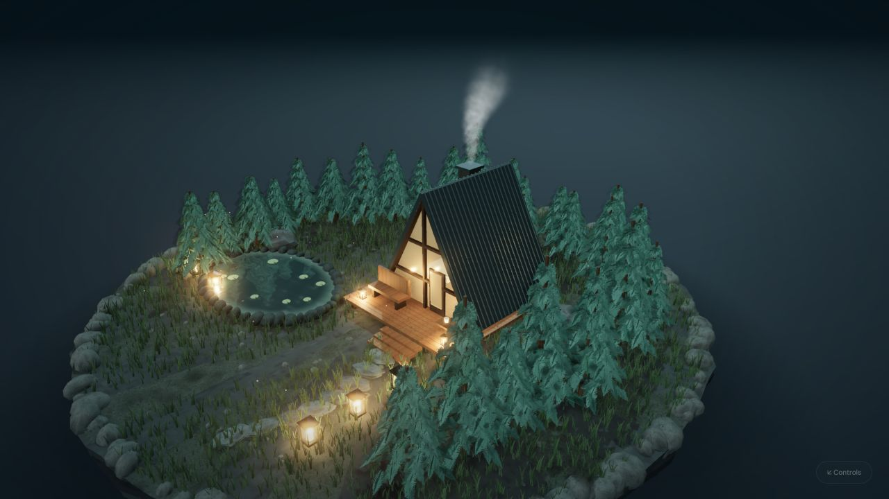

# Agent-Native 3D Scene Studio

**A little world. To slow down in.** Ask your browser agent for a calming lofi scene. A cabin, pond, pines and lanterns appear gradually; music fades in and a cinematic camera keeps drifting. Everything stays editable in the shared three.js scene.

[Lofi review build](https://diorama-review--agent-native-3d-studio.netlify.app) · [Production studio](https://agent-native-3d-studio.netlify.app) · [30-second demo script](DEMO.md) · [Submission description](SUBMISSION.md) · [MIT license](LICENSE)



## Create a lofi scene

Click **Create a lofi scene** for the local experience, or give a WebMCP browser agent this prompt:

> Create a calming lofi scene with a moonlit cabin, water, warm lanterns, slowly growing trees, an infinite cinematic camera and soft music. Use compose_lofi_scene, then describe_scene to check progress.

`compose_lofi_scene` accepts `mood` (moonlit or golden_hour), `seed`, `build_seconds` (12–90, default 32), `camera` (cinematic or orbit), and `music`. It starts a background session and returns a `session_id` immediately. This is an authored procedural composition that the agent configures through a semantic tool, not arbitrary text-to-mesh generation.

- **The scene unfolds:** pond → cedar A-frame cabin → forest → path and lanterns → music and camera. The progress and actual playback state are visible and available through `describe_scene`.
- **An endless camera:** `set_camera_motion` starts continuous orbit or a smooth periodic route with changing height, distance and focus. No endpoint cut; no maximum loop count. A circuit defaults to four minutes. Observation tools do not interrupt it.
- **Human control:** grabbing the canvas pauses the camera; during construction it also pauses the build. `control_lofi` pauses/resumes the complete session or stops it while retaining its objects. **Undo** restores the pre-composition scene, including when construction is interrupted.
- **Sound:** the local three-track playlist fades in softly. The UI and tools distinguish requested playback from actual playback. If the browser blocks audio, click **Enable sound**. Volume and mute remain available.
- **Clean view:** hides the interface for enjoying the scene. H or the unobtrusive **Controls** button brings it back. Exporting/recording video and YouTube upload are future work.

The local Create button calls the same handler with `actor: human`; it does not contact an AI model. A connected browser agent calls the registered WebMCP tool with `actor: agent`. **Tool activity** exposes the original arguments and response. The background session state is observable in both cases.

## Try the collaboration

1. Drag the wooden camp to another spot. Its blue outline and the **YOU** activity entry identify the human edit.
2. Give a connected browser agent the prompt below. It discovers the page tools, reads the actual selection and human edits, then adjusts the environment.
3. Click **Undo layout**. Only the layout's positions revert. The camp, later edits and material changes remain.

> Read the live scene, including my selection and human edits. Keep my camp exactly where I placed it. Use arrange_scene to adapt the path, trees and lanterns around it, keeping access clear. Then frame a beautiful shot.

**Try layout** calls the same handler locally, with `actor: human`. **Guided tour** is an explicitly labeled local script, with `actor: demo`. Neither button invokes an AI model. A connected agent's WebMCP calls appear as **AGENT · WEBMCP**, with the full request and result available in the activity log.

## Why WebMCP matters here

The WebGL canvas doesn't expose the scene graph through the DOM. A screenshot contains visible objects, but not their stable ids, exact positions, human-edit history or undo semantics. WebMCP lets this page publish those capabilities as discoverable, structured tools in the same live browser session. The agent can observe, act and verify while the person keeps the mouse.

A custom API or other automation integration could provide similar capabilities. The contribution here is the **standard browser-facing contract**, shared live state and reversible collaboration—not a claim that 3D automation is otherwise impossible. See the [Chrome WebMCP documentation](https://developer.chrome.com/docs/ai/webmcp).

## What is implemented

- Procedural A-frame cabin with a furnished interior, glazed front, reading porch and softly dissipating GPU chimney smoke. A stone-lined pond reflects the actual scene, with layered wave normals, Fresnel reflection and a shallow shoreline.
- Procedural forest diorama: fine evergreen needle silhouettes, wood grain, beveled terrace furniture, glass lanterns, layered rock, instanced grass, reflection lighting, ambient occlusion and restrained bloom. No external model or texture downloads.
- `describe_scene` exposes `selected_id`, `human_edits`, scene version and layout history. `query_scene` adds pagination and real world-space bounds.
- `arrange_scene` plans around the live camp and fixed objects before changing anything. Existing human edits and untagged objects stay fixed. Blocked arrangements fail without partial placement.
- `undo_layout` and `redo_layout` use a position journal. Objects moved later or rebuilt by import/reset are skipped. Human takeover during a layout interrupts affected movement; grabbing its camp stops the arrangement.
- Real provenance: WebMCP, local buttons and the guided tour are labeled separately. The actor label identifies the invocation path; it is not authentication of a remote model.
- Human camera takeover, reduced-motion handling, optional performance mode, five lighting moods, scene share links, general building tools and chess geometry.

## Rendering work and CPU use

The full cinematic image retains its resolution, ambient occlusion, bloom and shadow detail. A 60 FPS ceiling avoids unnecessary rendering on high-refresh displays. Static geometry is batched by material without removing triangles; only changed object transforms are recomputed. Sun shadows are cached until an object or light changes. Smoke is evaluated in one GPU particle draw, and lighting updates sky uniforms instead of uploading a repainted texture. Hidden tabs skip rendering.

`describe_scene.rendering` exposes actual frame rate, CPU submission time, draw calls, triangles and shadow updates. CPU submission time covers application work and graphics submission; it is not whole-machine CPU usage or GPU time. Real water reflection adds one view of the scene per visible pond; multiple ponds and large shared scenes can still be expensive.

## Tools (26)

| Purpose | Tools |
| --- | --- |
| Lofi session | `compose_lofi_scene`, `control_lofi`, `set_camera_motion` |
| Discover and inspect | `help`, `describe_scene`, `query_scene` |
| Cooperate around human placement | `arrange_scene`, `undo_layout`, `redo_layout` |
| Build and edit | `add_object`, `transform_object`, `set_material`, `scatter`, `delete_objects` |
| Direct the scene | `set_lighting`, `frame_camera`, `camera_path`, `set_ui`, `set_music` |
| Save and restore | `snapshot`, `undo`, `export_scene`, `import_scene` |
| Group operations | `batch` |
| Chess geometry | `board_square`, `chess_move` |

Registration uses `document.modelContext.registerTool({ name, description, inputSchema, annotations, execute }, { signal })`. Tools return an operation envelope containing `ok`, `operation_id`, `actor`, before/after scene versions, `applied`, `duration_ms` and a result or error. Mutating tools can reject stale observations through `expected_scene_version`. Animations settle before the call reports live values, except explicit bulk `add_object{animate:false}` and the background lofi/camera tools, which report acceptance immediately and expose ongoing state.

General edits use whole-scene snapshots. Cooperative arrangements have their own position journal; use **layout undo** to preserve later human work. Layout tools and background lofi/camera controls cannot be nested inside `batch`. A running or paused lofi construction rejects competing scene edits until stopped, while allowing observation, undo and session controls. A running layout rejects competing tool mutations while still allowing mouse interaction and read-only queries.

## Run and verify

```bash
npm ci
npm run dev
npm run build
npm run smoke
```

The smoke suite uses its own free preview port, exercises every listed tool and checks observable behavior: pointer placement, preserved camp coordinates, selective undo/redo, later edits, invalid calls, import validation, ordinary undo and stale versions. Results are written to `scripts/smoke-result.json`. GPU-less CI runs the same semantic suite in Performance mode through software OpenGL; the cinematic view is also checked in a hardware-accelerated browser.

Native WebMCP requires a supporting browser/client. In supported Chrome testing builds, enable `chrome://flags/#enable-webmcp-testing`; the status chip reports actual API availability. The scene and local controls also work without WebMCP. `?agent=1` exposes a clearly labeled developer harness for handler tests.

## Limits

- The editable surface is flat at y=0; the layered island is art direction, without physics or terrain simulation.
- Layout adaptation applies to the starter scene's tagged paths, grove and lanterns around a camp. It is not a general-purpose layout solver. Fixed obstacles can make a request infeasible.
- A one-second scene operation does not imply a one-second model response. Agent discovery and reasoning time depend on the client. The 30-second presentation is an edited real session.
- General snapshot undo replaces the whole scene. Only layout undo preserves unrelated later edits.
- Reduced-motion preference keeps the lofi camera still and removes growing-object animation. Continuous motion can still be explicitly requested.
- Share links preserve cabin/pond geometry and materials, but not session timers, camera routes or audio playback.
- Materials are edited per object. Share links carry scene state, not the live undo journal or accounts, and can become long.
- Chess tools provide geometry and animation, not a chess rules engine.
- Cinematic rendering costs more than performance mode; frame rate depends on hardware, viewport and scene size.

MIT licensed. Bundled DM Sans and Manrope fonts use their respective SIL Open Font Licenses in [public/fonts](public/fonts). Built with TypeScript, three.js and Vite for [The WebMCP Challenge](https://webmcp.devpost.com/).
