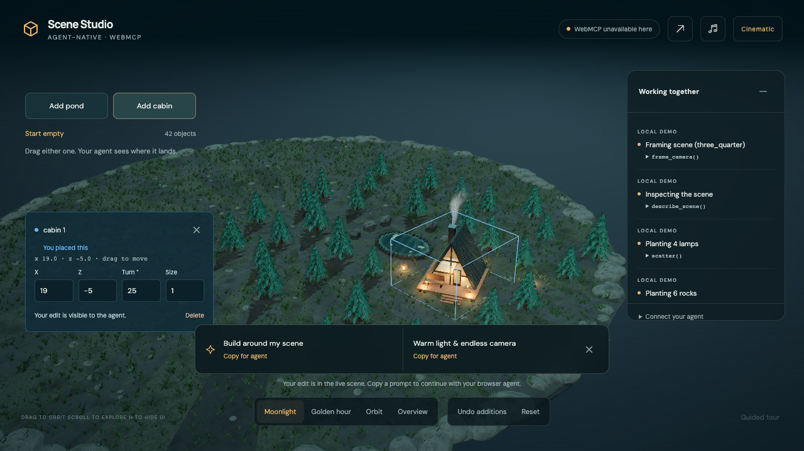

# Agent-Native 3D Scene Studio

**Build a little world together.** Place a pond and cabin yourself, then ask your browser agent to grow a forest around them. Move a tree by hand. The agent reads that change, keeps your placement, and gives the same world its lighting, music and a slow cinematic camera.

[Open the studio](https://agent-native-3d-studio.netlify.app) · [Judge guide](docs/JUDGE-GUIDE.md) · [Submission story](SUBMISSION.md) · [2:41 film plan](DEMO.md) · [MIT license](LICENSE)

No application login, API key or backend is required. The connected browser agent supplies the model; this page supplies live objects and structured actions. Local editing also works without an agent. The current collaboration release and its new native demonstration are tracked in the [review record](docs/FINAL-REVIEW.md); the current native recording verifies this flow independently of the earlier gallery film.



Local handler QA of the current editor. The complete native collaboration was subsequently recorded in the Codex browser; see the review record.

## Build with an agent

1. Click **Start empty**, then **Add pond** and **Add cabin**. Drag them where you want them.
2. Connect a WebMCP-capable browser agent and send the prompt below. Its native calls appear as **AGENT · WEBMCP**, with the actual arguments and results in Tool activity.
3. Move one of its trees yourself. Ask it to read the new selection and human edits before making the next change.

> Read the scene I have built. Identify my pond and cabin, their current positions, bounds and human edits. Keep both exactly where I placed them. Add thirty pine trees around them, keeping the water, shoreline and cabin entrance clear. Verify the added count and my unchanged placements.

Then:

> Add six shoreline rocks and four warm lanterns around our existing scene. Keep its objects in place and leave a clear approach to the cabin. Read back what changed.

After moving a tree:

> I moved one tree. Read the current selection and human edits, identify its new position, and keep it there. Give our scene soft moonlit lighting and start a slow continuous cinematic camera. Keep every object's placement unchanged. Verify the camera and actual music playback state.

The agent can use `describe_scene` and `query_scene` to inspect the current objects, then `scatter`, `add_object`, `set_lighting` and `set_camera_motion` to act. These tools work on the scene you have made. No recipe replacement is needed for this interaction.

## What the shared state provides

Objects have stable IDs, poses and visible ownership information: `created_by`, `last_changed_by`, `revision` and `human_revision`. `describe_scene` also exposes selection, human edits and `recent_changes`. The actor identifies the input route, not an authenticated model or account.

`scatter` adds an exact requested number around an optional live `anchor`. It plans against actual object bounds and cabin entrance space, with a default clearance of 0.4. A crowded request returns `no_space` without partial additions. Results report requested and live counts, added IDs, preserved IDs and an `undo_id`. A human interruption can change the live count; the response reports that outcome.

`undo_scatter` removes that scatter's additions while keeping objects a person changed afterward. Cooperative camp layouts have their own `undo_layout` position journal. General `undo` restores a whole-scene snapshot and has broader effects.

Mutations accept `expected_scene_version`. If a person changes the scene after the agent reads it, a stale request is rejected so the agent can inspect the new state. Read-only observations leave continuous camera motion running. Grabbing the camera pauses it; explicit resume returns control to the director.

## Atmosphere and the gallery

Lighting blends between five moods. `set_camera_motion` starts a continuous orbit or cinematic route around the current scene or a chosen object. Sound controls distinguish requested playback from actual playback; click **Enable sound** if the browser needs a gesture. The bundled three-track playlist has volume and mute controls.

The optional gallery supplies three authored procedural recipes: **Lakeside Cabin**, **Lantern Grove** and **Island Hideaway**. `compose_lofi_scene` can build one, or cycle through them with an adjustable hold. This is a separate starting-point experience: composition replaces the existing scene. Keep the gallery outside a continuous co-creation session unless replacement is intentional. [Gallery image](docs/lofi-retreat.jpg).

Local buttons call the same handlers with human provenance. A guided tour is labeled as a local script. Neither connects to an AI model. The `?agent=1` developer harness verifies handlers; it is not evidence of native WebMCP discovery.

## Why WebMCP fits

A WebGL canvas shows pixels while object IDs, precise positions, bounds and edit history live inside the application. WebMCP publishes those capabilities to a browser agent in the same live page. The agent can read what the person built, use the page's actions, and verify the result.

The useful handoff is concrete: “Keep what I placed; build around it.” The page provides object-aware placement and undo semantics, while the agent translates the request into tool calls. The person continues to work with the mouse. A custom integration could expose similar capabilities; WebMCP provides the browser-facing discovery and execution contract.

## Tools (27)

| Purpose | Tools |
| --- | --- |
| Discover and inspect | `help`, `describe_scene`, `query_scene` |
| Add an environment | `scatter`, `undo_scatter` |
| Build and edit | `add_object`, `transform_object`, `set_material`, `delete_objects` |
| Direct the scene | `set_lighting`, `frame_camera`, `camera_path`, `set_camera_motion`, `set_ui`, `set_music` |
| Cooperative camp layout | `arrange_scene`, `undo_layout`, `redo_layout` |
| Save and restore | `snapshot`, `undo`, `export_scene`, `import_scene` |
| Group operations | `batch` |
| Authored gallery | `compose_lofi_scene`, `control_lofi` |
| Chess geometry | `board_square`, `chess_move` |

Registration in [src/webmcp.ts](src/webmcp.ts) uses `document.modelContext.registerTool`. JSON schemas describe inputs and side-effect annotations. Results include `ok`, `operation_id`, `actor`, scene versions, `applied`, `duration_ms` and a result or error. Finite animations settle before reporting live values; background camera and gallery sessions acknowledge acceptance and expose ongoing state separately.

## Run and verify

Use Node.js 22, as in CI. The application needs no environment variables.

```bash
npm ci
npm run dev
```

For local release checks:

```bash
npm run build
npm run test:animations
npm run test:lofi
npm run smoke
```

The smoke suite starts a fresh preview port and uses system Chrome or Playwright's Chromium. If neither is installed, run `npx playwright-core install chromium`. CI installs Chromium and its dependencies. The suite exercises the labeled developer harness and checks scene semantics; native discovery and cinematic appearance need the separate [judge walkthrough](docs/JUDGE-GUIDE.md). Current results and open gates are recorded in [FINAL-REVIEW.md](docs/FINAL-REVIEW.md).

Native WebMCP needs a supporting browser and client. In Chrome 149+, enable `chrome://flags/#enable-webmcp-testing`, relaunch, and connect a compatible agent. The status chip reports actual API availability; a flag alone does not connect a model.

## Demo production

[video-narration.json](docs/video-narration.json) defines the eight shots, their narration and the **161-second** timeline. The new film follows one retained scene from human placement through agent additions, a human edit and the agent's response. The native capture now verifies that flow on one retained scene; the previous 135-second gallery film is historical material.

Local planning does not need recordings, credentials or API calls:

```bash
npm run audio:elevenlabs -- --plan
node scripts/encode-demo-capture.mjs --plan
node scripts/assemble-demo.mjs --plan
```

Approved narration uses ElevenLabs **Lily — Velvety Actress**, model `eleven_v3`. Generating missing tracks requires `ELEVENLABS_API_KEY` and makes paid API calls. Cached MP3s retain character alignment and generation provenance. Swift/AppKit, `ffmpeg` and `ffprobe` handle local captions and assembly on macOS. See the [recording plan](docs/recording-plan.md) for production commands and the required continuity evidence. The helpers do not record a browser or upload a submission.

## Implementation and limits

- Procedural geometry supplies cabins, reflective ponds, forests, rocks and lanterns. The agent arranges these editable assets; it does not generate arbitrary meshes or new music.
- The editable surface is flat at y=0. Object bounds and reserved entrance space guide placement; this is not physics or terrain simulation.
- Cinematic rendering uses reflection, ambient occlusion, bloom and shadows. Performance mode reduces effects. Frame rate depends on hardware and scene size; additional ponds require additional reflection views.
- Reduced-motion preference limits automatic camera and reveal animation. Continuous camera motion can still be explicitly requested.
- Share links preserve objects, materials, lighting and camera pose, but not playback, running timers or undo history. Keep the copied/returned link: export leaves the current URL unchanged, and opening a share clears its hash after restoration. Reloading the resulting clean base URL does not retain that restored scene.
- There is no account-based cloud save or multi-user room. Person and agent share the current page.
- Chess tools provide geometry and movement, not a chess rules engine.

Core source: [tool registration](src/webmcp.ts), [editing handlers](src/tools.ts), [object state](src/store.ts), [pointer interaction](src/interaction.ts), [layouts](src/layout.ts), [snapshots](src/snapshot.ts), [rendering](src/scene.ts), [gallery recipes](src/lofi-scenes.ts), [media plan](scripts/demo-plan.mjs).

MIT licensed. Bundled DM Sans and Manrope include SIL Open Font Licenses in [public/fonts](public/fonts). Thomas Werner supplied the three music tracks; [music credits](public/music/README.md) record their provenance. Built with TypeScript, three.js and Vite for [The WebMCP Challenge](https://webmcp.devpost.com/).
