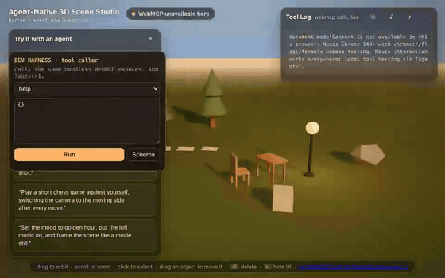

# Agent-Native 3D Scene Studio

**Canvas applications expose almost no reliable semantic structure to DOM- and accessibility-tree-based agents.** Vision models can drag pixels over a screenshot, but they get no stable state-and-action contract: no ids, no queries, no reversible operations, no guarantees. CAD tools, GIS and mapping, medical imaging, DAWs, video editors, data-visualization dashboards, game engines, design tools like Figma's canvas — all of them are effectively agent-inoperable today for this reason. [WebMCP](https://developer.chrome.com/docs/ai/webmcp) is the first API that changes that — and this studio is the working proof case: a live three.js scene where an AI agent builds, lights, scores and *directs* while a human keeps full mouse control at the same time. Nothing here is simulated; every agent action goes through real WebMCP tool calls you can inspect in the on-page log.

**About 60 seconds, no setup:** press **“▶ Watch the agent write the scene”** and watch the real WebMCP calls build a forest, camp and glowing signature. There is no cloud screensaver at the end: the camera lands on the artifact, then hands control back to you.

> *"Plant an avenue of trees along the stone path, then fly an exciting camera flight through it."*



**No Chrome flag handy?** Every tool also runs through the built-in dev harness: open [`?agent=1`](https://agent-native-3d-studio.netlify.app/?agent=1) — same handlers, honestly labeled `DEV HARNESS`. Or share any scene with the ⧉ button / `export_scene` — the link contains the whole scene and opens for anyone.

**All tools verified:** `npm run smoke` → 20/20 ok (`scripts/smoke-result.json`).

## Why this needs WebMCP (not just benefits from it)

The entire application state — objects, transforms, materials, camera, light — lives in the three.js scene graph, invisible to DOM- and accessibility-based actuation. The best a vision-driven agent can do without WebMCP is blindly drag pixels across a screenshot — guessing, with no way to verify what it changed. Most WebMCP demos put tools on top of a page the agent could always have actuated through the DOM anyway — for them, WebMCP is an accelerant. Here it is the **prerequisite**: without it the studio does not exist for an agent at all. Twenty structured tools turn that black box into a shared workspace:

- **The scatter before/after.** "Scatter 40 trees across the left half of the meadow, but keep the stepping stones and the seating area clear" is roughly **twenty minutes of manual click-place-adjust work** — and **zero** for an agent without WebMCP, because there is nothing to click. With `scatter{type:"tree",count:40,exclusion_zones:[…],seed:42}` it is one sentence, executed in seconds, reproducible via the seed.
- **Measured: agent wall-clock is model turns, not the scene.** In a live Codex run, 8 successful tool calls took **3 min 12 s** wall-clock while total scene animation was **under 3 s**. The time went into orientation and one failed call — model turns, not rendering. That measurement is why `batch` exists (1–200 tool operations in one call, one snapshot, whole-batch undo): the biggest speed lever for agents is fewer round trips, and every WebMCP tool author will hit the same wall. This is concrete API feedback to the Chrome team, from the only class of app where it could be measured this cleanly.
- **Reversibility is the trust primitive.** Every mutating tool auto-captures a restore point; `undo` steps back, ↺ resets, `export_scene`/`import_scene` turn any state into a share link that opens for anyone — no backend.

## Try it live

**URL:** <https://agent-native-3d-studio.netlify.app>

Requirements (the API is experimental, so one-time setup):

1. **Chrome 149 or newer** (stable, Beta, Dev, or Canary — check `chrome://version`).
2. Open `chrome://flags/#enable-webmcp-testing`, set **Enabled**, and relaunch.
3. Optionally install the agent simulator: the free
   [Model Context Tool Inspector](https://chromewebstore.google.com/detail/gbpdfapgefenggkahomfgkhfehlcenpd)
   extension (by the Chrome team). It lets you chat with the page's tools directly.
4. Load the studio. The status chip top-left should turn green: **“WebMCP live · 20 tools”.**

Then paste any of these into the Inspector (or any WebMCP-aware agent) and watch the scene change while your mouse stays fully functional:

| # | Prompt | What it exercises |
|---|--------|-------------------|
| 1 | “Set the mood to golden hour, then frame the scene like a movie still.” | `set_lighting` + `frame_camera` |
| 2 | “Make it night and let the lamp glow warm.” | `set_lighting` + `set_material` (emissive drives the lamp’s real light) |
| 3 | “Build a cozy camp spot: a table with a chair, a lamp next to it, and a window facing the seating area.” | multi-step `add_object` + `transform_object` |
| 4 | “Scatter 40 trees across the left half of the meadow, but keep the stepping stones and the seating area completely clear.” | `describe_scene` + `scatter` with `exclusion_zones` |
| 5 | “What’s in the scene right now? Then move the table two meters toward the window and give me a hero shot of it.” | `describe_scene` → `transform_object` → `frame_camera` |
| 6 | “Hide the UI, then fly a cinematic tour: start on the window, sweep past the lamp, and end on a hero shot of the table.” | `set_ui` + `camera_path` — the reveal moment |
| 7 | “Plant an avenue of trees along both sides of the stone path, add a few boulders, then fly an exciting camera flight right through the avenue.” | two `scatter` rows + `camera_path` through the trees |
| 8 | “Set up a chessboard with pawns next to the picnic table, zoom in, and play your first move against me — animate the piece.” | `add_object` (chessboard/chess_piece) + `board_square` + `transform_object` + `frame_camera` |
| 9 | “Delete all pawns — kings-only chess. Switch the camera to whoever's turn it is.” | `delete_objects` by name filter + per-turn camera swaps |

While an agent works: **drag to orbit, click to select, drag objects to move them, ⌫/Delete to remove, H to toggle the HUD.** Grabbing the camera also cancels any in-flight agent camera move — the human always wins. Every tool call appears in the visible **Tool Log** (top right), each mutating tool auto-saves a restore point (↺ button or `undo` tool steps back).

No WebMCP in your browser? The scene still works with the mouse, the chip tells you exactly what's missing, and `?agent=1` exposes a local dev panel that calls the identical tool implementations — clearly labeled as a dev harness, never auto-activated.

## The tools

| Tool | Purpose | Why this shape |
|------|---------|----------------|
| `help` | The full agent playbook: workflow conventions, build/camera/chess recipes, human-interaction guarantees — one tool result. | An agent that reads one row of the table understands the whole studio; `help` compresses that onboarding into a single call. |
| `describe_scene` | Scene overview: object counts, first objects, camera, lighting. | The eyes. Without it the agent is blind; with it, one-way commands become a dialogue (look → critique → refine). |
| `query_scene` | Paginated object query: filters, field selection, real bounding boxes. | Large scenes stay fully observable — `total`/`next_offset` page through everything, so an agent never mistakes a truncated view for the whole scene. |
| `add_object` | One object: primitives, furniture presets (tree, rock, lamp, window, chair, table) and game pieces (chessboard; chess_piece with `piece`: pawn/rook/knight/bishop/queen/king and `side`: white/black — six distinct turned silhouettes). | Scoped to a single, well-validated creation with enums for every type — no free-form hallucination surface. |
| `transform_object` | Move/rotate/scale one id, a name, or a batch — absolute or relative. | Batch targets + relative mode match how people actually direct edits (“move those three back a bit”). |
| `set_material` | Color, roughness, metalness, emissive, opacity. | Material personality in one call; emissive also drives the lamp’s real point light, so “make it glow” *glows*. |
| `set_lighting` | Five curated mood presets (golden_hour, night_neon, studio, overcast, moonlit) + intensity + sun azimuth. | Sky, fog, sun, ambient switch as one coherent, animated mood instead of five fiddly parameters to hallucinate. |
| `frame_camera` | Animated fly-to shot of an object or the whole scene (6 angles, distance, focal length, optional `select:false` for clean frames). | Gives the agent cinematography: hero and three_quarter angles, 35mm-equivalent lens. The result reports the pose only **after** the move has settled. |
| `camera_path` | Direct a sequence: 2–12 keyframed shots with per-shot angle, lens, flight time and hold, cinematic easing, optional loop. | From moving the camera to **directing** it — tours, reveals, orbit drama. Interruptible by the human at any moment; completed shots are reported per keyframe. |
| `set_ui` | Show/hide the HUD (tool log, panels). | The agent can stage its own reveal: build, hide the UI, run the camera path, hand back. Humans press H at any time. |
| `scatter` | Distribute up to 200 instances over an area with jitter, scale/rotation variance and **exclusion_zones**. | The 20-minutes-by-hand proof moment: “a forest, but not on the path.” |
| `delete_objects` *(bonus)* | Batch removal by targets, type or name filter (“delete all pawns”). | Group edits are as natural as single edits; staggered shrink-out animation, undoable like every mutation. |
| `board_square` *(bonus)* | Ask a chessboard where square e4 is (world position). | The scene stays a scene — chess *rules* live in the agent; the board only answers geometry questions. Precise moves without coordinate math. |
| `chess_move` *(bonus)* | Perform a move: resolves the square, animates the piece with a small lift, optional `camera: "follow"|"hero"`. | One call = a complete, visible chess move. The *rules* stay in the agent's head; the scene performs. This is what makes agent-vs-agent chess presentable. |
| `snapshot` *(bonus)* | Save a named restore point. | Reversibility is a trust primitive — Chrome's own security guidance asks for it. |
| `undo` *(bonus)* | Step back to the last restore point. | Every mutating tool auto-captures one before it runs, so undo is always meaningful — including after an agent mistakes. |
| `set_music` *(bonus)* | Put lofi on/off — three self-made Suno tracks as a playlist (volume). | Agents don't just shape the scene, they set its mood: "put some lofi on" while the camera flies. Browser autoplay policy may hold audio until the first click; the result says so. |
| `export_scene` *(bonus)* | Export objects + camera + lighting; sets the page URL to a `#scene=...` share link. | Scenes become artifacts: link opens for anyone, no WebMCP, no flag — the judge sees the exact scene. Also the answer to "no persistence": links ARE the persistence. |
| `import_scene` *(bonus)* | Restore an exported scene (JSON or share link). Captures an undo snapshot first. | Modify a shared scene with the agent, experiment, `undo` back — collaboration on top of artifacts. |
| `batch` *(bonus)* | Run 1–200 tool calls in one turn: one snapshot, one result, whole-batch undo. | Measurement showed model turns dominate agent wall-clock, not the scene. `batch` is that lesson turned into tool design — a whole setup in one call. |

## How the WebMCP integration works

Tools are registered through the WebMCP imperative API, guarded by feature detection so the page degrades gracefully in non-WebMCP browsers. This is the real registration path from [`src/webmcp.ts`](src/webmcp.ts):

```ts
export async function registerTools(ctx: ToolContext, log: ToolLogger): Promise<number> {
  const mc = document.modelContext;
  if (!mc) return 0; // status chip explains what's missing

  for (const def of TOOL_DEFS) {
    await mc.registerTool(
      {
        name: def.name,
        description: def.description,        // tells the model *when* to use the tool
        inputSchema: def.inputSchema,        // strict enums + ranges: no free-text to hallucinate
        execute: async (input) => invoke(ctx, def, input ?? {}, log),
      },
      { signal: controller.signal },         // owning the tool lifecycle
    );
  }
  return registered;
}
```

Design decisions worth calling out (all learned from live agent testing):

- **Uniform operation envelope.** Every invocation returns `{ok, operation_id, actor, scene_version_before, scene_version_after, applied, duration_ms, result|code+error}` — generated centrally in the invocation layer, so agents can verify their own work and measure call cost.
- **Optimistic concurrency.** Mutating tools accept an optional `expected_scene_version`; if the scene moved since the agent observed it (the human touched something), the call is rejected with a typed `stale_scene` error instead of overwriting the human's change.
- **Results are only reported after the animation settles.** Tools `await` the scene transition and then report the *live rendered* values — an immediate `describe_scene` after `transform_object` matches the tool result, always.
- **Human interruption is explicit.** If the user grabs the camera or a newer command supersedes a transition, the tool says so (`applied: false` + live values) instead of pretending success.
- **`scene_version` + `operation_id`** on every mutation (camera moves included) let an agent detect stale observations.
- **Typed errors:** failures carry a machine-readable `code` (`unknown_type`, `ambiguous_target`, `unknown_target`, `out_of_range`, …) plus a human `error`.
- **Side-effect annotations** on every tool: `readOnlyHint` on the query tools, `idempotentHint` on material/lighting/camera/scatter, `destructiveHint` on `undo`.
- **Reproducible layouts:** `scatter` accepts an RNG `seed` (always returned) and `avoid_object_ids` with real bounding-box footprints (`footprint: "actual_bounds"`).
- **Chess, agent-native style:** the scene ships board + a full piece set (six distinct lathe-turned silhouettes, white/black colorways) + a `board_square` geometry oracle — the *rules* stay in the agent's head. It asks where e4 is, moves the piece, zooms in for the move, turns the camera to your side on your turn.
- **Strict validation in code, loose in schema**, with descriptive errors (“Ambiguous target »tree« matches 3 objects: … use an id”) so the model can self-correct.
- **`annotations.readOnlyHint** on `describe_scene`; mutating tools auto-snapshot for `undo`.
- **Agent onboarding, three surfaces.** (1) The `help` tool hands any injected agent the full playbook in one call. (2) A `<script type="application/json" id="agent-manifest">` in the DOM gives DOM-scraping agents the tool list and conventions. (3) A console banner carries the standard `document.modelContext.getTools()` + `executeTool()` recipe for harnesses that drive Chrome without a WebMCP client (CDP-only agents) — the page stays addressable even when the harness isn't.
- The same handlers power a query-param dev harness (`?agent=1`) — one code path, honestly labeled, never faked.

## Known limitations

- **Experimental browser API.** WebMCP needs Chrome 149+ with `chrome://flags/#enable-webmcp-testing`; other browsers get the mouse-only experience with an honest status chip.
- **One flat meadow.** The ground is a circle at y=0 — no terrain, physics, or water. `exclusion_zones` are axis-aligned rectangles.
- **The scene doesn't play chess.** There is no rules engine: pieces are objects, `board_square` is geometry only. Legal-move knowledge lives in the agent (LLMs know chess); nothing stops an illegal move except the agent itself.
- **Persistence is the share link.** `export_scene` packs the whole scene into a `#scene=...` URL — that link IS the save file, and `import_scene` restores it (undo-safe). A plain reload still resets to the starter scene; server-side accounts are deliberately out of scope.
- **Material edits are object-wide.** `set_material` re-tints all parts of a preset; per-part editing (e.g. only the trunk) is not exposed.
- **Scene size is bounded** (radius ≈ 60, 200 instances per scatter). `describe_scene` truncates its object list at 40 by design — use `query_scene` for the full paginated listing (up to 200/page).
- **`camera_path` loops are capped** at 3 repetitions / 90 s so a runaway agent can't hold the camera hostage; grabbing the camera always wins.
- Mouse-dragging an object mid-tool-call is allowed and simply wins — agents can detect the change via `scene_version`.

## Dev

```bash
npm install
npm run dev      # http://localhost:5173  (append ?agent=1 for the dev tool panel)
npm run build    # typecheck + production build to dist/
```

## License

[MIT](LICENSE) — built with [three.js](https://threejs.org) for [The WebMCP Challenge](https://webmcp.dev). Tool-design references: the [WebMCP docs](https://developer.chrome.com/docs/ai/webmcp) and [GoogleChromeLabs/webmcp-tools](https://github.com/GoogleChromeLabs/webmcp-tools) demos.
